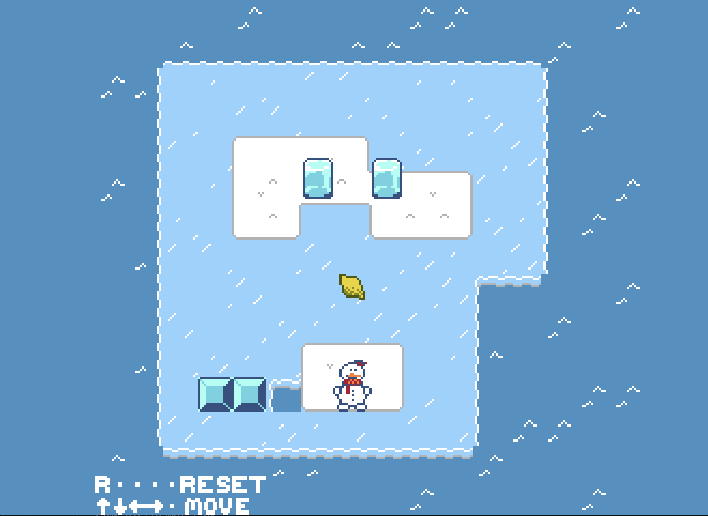
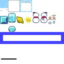
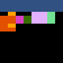
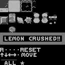
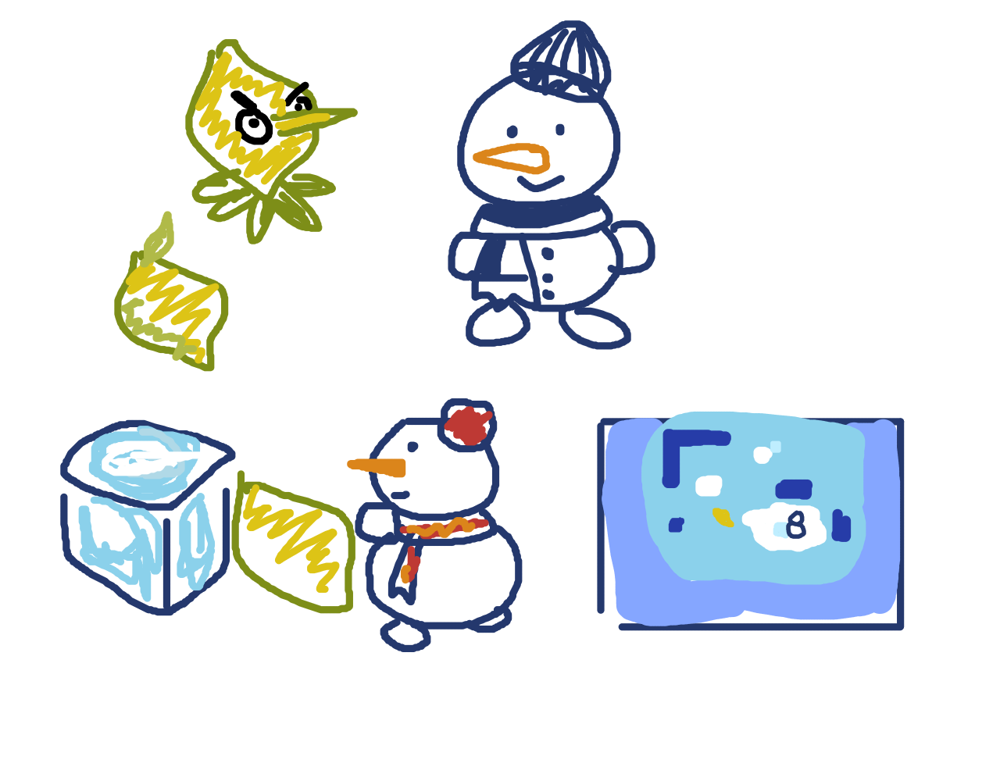

# Lemonbanza

Author: Runkun Chen (runkunc)

Design: A Sokoban-inspired puzzle game about crushing lemons into ice cubes on slippery surface.

The game has a total of 5 levels. The palette is restricted to NES colors.



#### How Your Asset Pipeline Works

Spritesheet (+color palette) and level layouts are individually loaded from PNG files under `./sprites` into two code files, `Assets.hpp` and `GameLevels.hpp`, which defines all data as constants.

The asset pipeline (`build_assets.py`) is written in Python. In short, the script would
1. Build `Assets.hpp` from the spritesheet (`sprites/spritesheet.png`) and palette index sheet  (`sprites/colorsheet.png`):
   1. Read both PNG files. `spritesheet.png` is the fully colored 16x16 spritesheet containing every tiles, which was drawn in Aseprite; `colorsheet.png` is the "palette index sheet", which means that for every tile that shares the same color in `colorsheet.png`, the tiles in `spritesheet.png` uses the same palette. There are 8 palette indices mapping to 8 regions in total.   
   2. Using the palette indices, the RGBA colors are converted to 2bit colors used by the PPU (shown above as grayscale image). 
   3. The 2bit image is compiled into C++ in `Assets.hpp` as very huge constant declarations.
   4. The colors, which are named in `build_assets.py`, also get some registered into the constants by their names, mapping to their color index right-shifted by 8. For example, `const uint32_t BCOL_CARROT = 768;` is the value defined for the snowman's face.
   5. Each in-game entity is composed of multiple sprites, which are rigged in a hardcoded way; what each sprite should be is specified in `sprites/sprite_def.json` and written into constants in `Assets`.
   6. Everything is written into `Assets.hpp`. `PlayMode` would then load constants from the file into the PPU.
2. Build `GameLevels.hpp` from the level sheets inside `sprites/levels/`.
   1. Each level is recorded as an RGBA image of 16x30 size. I used image because it is the easiest to edit. The upper 16x15 half represents the ground tiles, while the lower half represents entities. Example [here](sprites/levels/map_tutorial.png).
   2. Each color has a defined meaning (recorded in the Python script); the RGBA images are then mapped to arrays, and again, compiled into the huge chunk of code in `GameLevels.hpp`.
   3. The game hardcodes which level layout to read for each ingame level, loading them from `GameLevels.hpp`.


#### How To Play

The game mechanic and goal should be fairly self-contained and obvious. 

- `Arrow keys`: move
- `R`: reset current level
- `P`: **Skip current level**

DESIGN NOTES (aka. hints, hopefully **not needed** for clearing the game)
- Level 1 introduces the game mechanics. Forces the player to slide and push ice cubes on different surfaces, and learn the game goal (crushing lemons).
- Level 2 made it impossible to crush the lemon between a wall and an ice cube. Sliding the player towards the lemon will push the lemon into a non-recoverable place. The solution is to get one of the ice cubes to the bottom, then crush the lemon inbetween.
- Level 3 is similar to Level 2 except that it has 3 cubes and no walls. The trick is to stop one ice cube in the middle (directly above the lemon) by using another cube to block its way...
- Level 4 introduces floating ice. Again the game forces you to run into the mechanic. The rest is standard sokoban. The lemon has to be pushed around and transported to the center to be crushed vertically.
- Level 5 expands on Level 4.
- I expect the game to be beatable in about 8 minutes?

##### Compiling the game

The repository should come with built assets. But if one would still like to run the assets pipeline:
```bash
python build_assets.py
```

It is workdir sensitive. `cd` into the repository before executing it.
You will also need `PIL` and `numpy` installed for Python (`pip install pillow numpy`). 

Then, compile the game and run:

```bash
node Maekfile.js && ./dist/game
```


----

This game was built with [NEST](NEST.md).



<div align="center">My concept art</div>